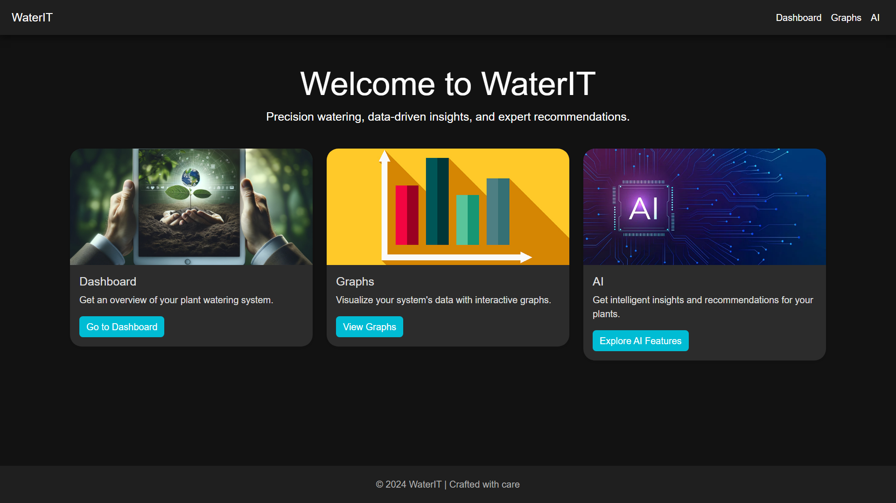

# WaterIT: Intelligent Watering and Monitoring



**WaterIT** is an automated plant watering system designed to optimize water usage and enhance plant health by utilizing real-time data and AI-generated insights. With a focus on sustainability, WaterIT helps conserve water in agriculture and household gardening through intelligent automation.

## 🌿 Problem Statement

Global agriculture consumes over **70%** of freshwater, and inefficient irrigation leads to **60%** water wastage. Meanwhile, **42%** of household wastewater remains untreated. WaterIT aims to tackle these issues by automating plant watering based on environmental data.

## 🌟 Features

- Automated watering based on real-time soil moisture levels.
- Real-time monitoring of soil moisture, water usage, temperature, and humidity.
- AI-powered insights for plant health using Google Generative AI.
- Web dashboard for easy control and data visualization.

## 🚀 How It Works

1. **Hardware**: 
   - **Arduino UNO**: Manages the water pump, soil moisture sensor, and servo motor.
   - **Soil Moisture Sensor**: Continuously monitors soil moisture and sends readings to the Arduino.
   - **Water Pump**: Activated by the Arduino when the soil is dry and deactivated once optimal moisture is reached.
   - **Servo Motor**: Moves to simulate a mechanical action when the pump turns off, enhancing the interaction.
   - **Relay**: Controls the power to the water pump based on moisture sensor data.
   
2. **Software**: 
   - The **Flask app** communicates with the Arduino via USB to receive moisture data and control the water pump.
   - Data such as soil moisture levels and water usage is stored in **SQLite databases** (`moisture_data.db` and `pump_data.db`).
   - Real-time environmental data like temperature and humidity is fetched using the **OpenWeatherMap API**.
   - AI-generated insights on plant care are provided using **Google Generative AI**, offering actionable advice based on the plant’s condition and external factors.

3. **Water Usage Calculation**:
   - The water used is calculated based on the duration the pump is active, with a flow rate of **0.0025 liters per second**.
   - After watering, the system calculates and logs the total water consumption, helping monitor usage over time.

4. **Mechanical Movement**:
   - When the pump turns off, the **servo motor** rotates 180 degrees, simulating a visual indicator of the water flow stopping.
   - After a short delay, the motor returns to its original position, ready for the next cycle.

## 💻 Installation

1. **Clone the repository**:
   ```bash
   git clone https://github.com/ZephyrusBlaze/WaterIT.git
   cd waterit
   ```

2. **Install dependencies**:
   ```bash
   pip install -r requirements.txt
   ```

3. **Set up environment variables**:
   - OpenWeatherMap API key
   - Google Gemini API key for AI insights

4. **Run the Flask app**:
   ```bash
   python app.py
   ```

## 🏗️ Project Structure

```bash
.
├── LICENSE
├── README.md
├── app.py
├── arduino-code
│   └── code.ino
├── moisture_data.db
├── pump_data.db
├── requirements.txt
├── static
│   └── images
│       ├── ai.png
│       ├── dashboard.png
│       └── graphs.png
└── templates
    ├── ai.html
    ├── base.html
    ├── dashboard.html
    ├── graphs.html
    └── index.html
```

## 📚 Libraries & Tools

- **Flask**: Web framework for the frontend and backend.
- **Datetime**: For handling timestamps.
- **Requests**: For fetching weather data from OpenWeatherMap.
- **PySerial**: To communicate with the Arduino via USB.
- **Google Generative AI**: For generating AI insights on plant care.

## 📈 Future Enhancements

- **Wireless Communication**: Integrating wireless sensors for better scalability.
- **Plant Species Detection**: Improving AI insights by factoring in specific plant needs.

## 📄 License

This project is licensed under the [Apache 2.0 License](LICENSE).